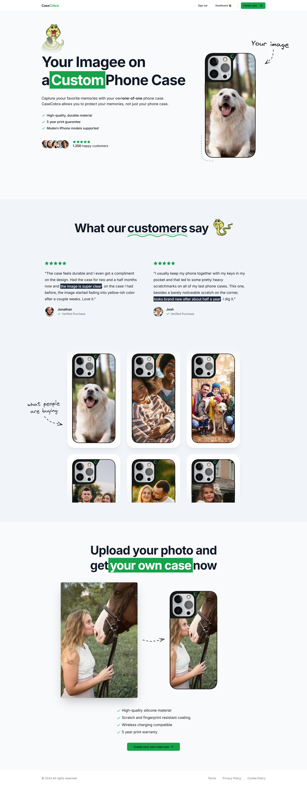

Here's a **README** file tailored for your CaseCobra ecommerce project:

---

# CaseCobra - Custom Phone Case Ecommerce

CaseCobra is a custom phone case ecommerce platform where users can design and personalize phone cases for modern iPhone models. The project features a step-by-step customization process, allowing users to upload images, choose case materials, and finalize their design. This project is a fully responsive web application, making it easy for users to interact with the platform on any device.

## 🌟 About Me

👋 **Full Stack Developer & UI/UX Enthusiast:**

With a focus on creating engaging and user-friendly ecommerce platforms, I have experience in developing scalable web applications with intuitive user interfaces. I strive to make technology accessible and aesthetically pleasing, ensuring seamless customer experiences.

💡 **Specialty in Custom Web Solutions**

From building unique ecommerce platforms using frameworks like **Next.js** and **React.js** to integrating engaging UI/UX designs, I bring a blend of technical expertise and creativity to every project.

🚀 **Why Choose Me?**

I prioritize both functionality and aesthetics, delivering web applications that not only perform well but look great, ensuring a memorable user experience. My services include:

- Ecommerce Web Development
- Custom UI/UX Design
- Full-Stack Web Application Development

📞 **Let’s Connect!**  
Ready to create a stunning online platform? Reach out, and let’s bring your vision to life.

---

## Project Features

- **Image Upload & Customization:** Users can upload their images to personalize their phone cases.
- **Material Selection:** Choose from various materials like silicone or polycarbonate.
- **Model Compatibility:** Supports customization for multiple iPhone models, from older to the latest releases.
- **Dynamic Preview:** Real-time preview of the customized phone case.
- **Responsive Design:** Fully responsive across devices, ensuring a consistent experience.
- **Eco-Friendly Packaging:** Packaging materials are eco-friendly, aligning with sustainable practices.

### 📸 Screenshots

#### Image Upload:



#### Image Upload:


#### Customization Screen:


#### Final Design Preview:


---

## Getting Started

To run this project on your local environment, follow these steps:

1. Clone the repository:
   ```bash
   git clone https://github.com/your-username/casecobra.git
   ```
   
2. Navigate to the project directory:
   ```bash
   cd casecobra
   ```

3. Install dependencies:
   ```bash
   npm install
   ```

4. Run the development server:
   ```bash
   npm run dev
   ```

5. Open [http://localhost:3000](http://localhost:3000) in your browser to see the platform.

---

## Technologies Used

- **Next.js**: A powerful React framework for server-side rendering and static site generation.
- **React.js**: For building a dynamic and responsive user interface.
- **Node.js**: Backend runtime for handling API requests.
- **CSS3** & **Tailwind CSS**: For modern, mobile-first styling.

## Learn More

To learn more about **Next.js** and **React.js**, check out these resources:

- [Next.js Documentation](https://nextjs.org/docs) - Explore the features and API of Next.js.
- [React.js Documentation](https://reactjs.org/docs/getting-started.html) - Learn about the core concepts of React.js.

---

## Deployment

The platform can be easily deployed using **Vercel** or any cloud service that supports Node.js. Check out the official [Next.js deployment guide](https://nextjs.org/docs/app/building-your-application/deploying) for more details.

---

Feel free to Contact me !